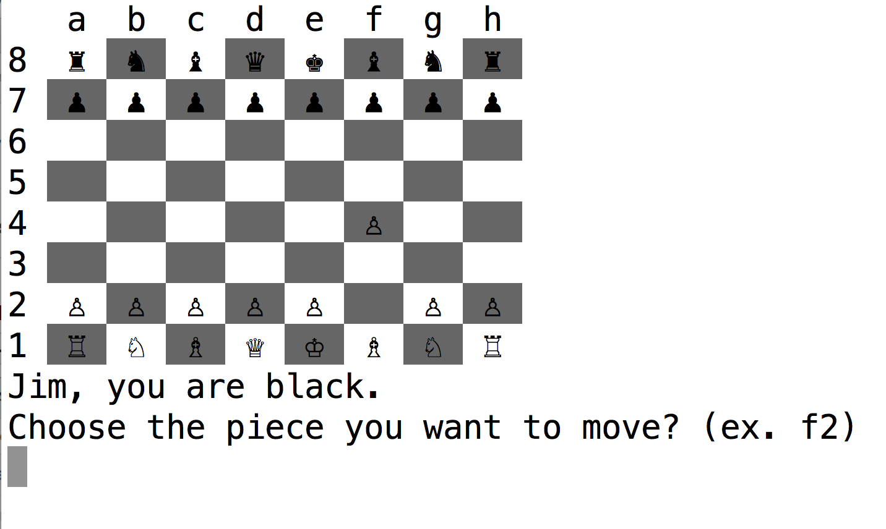

# Chess

#### A chess game - in your terminal

This Ruby implementation of Chess is built using object-oriented principles. All of the functionality of the game is split into logical classes. For example, pieces are split into classes of how they move (either sliding or stepping) that they each inherit from.

To run:

    gem install colorize
    ruby game.rb

